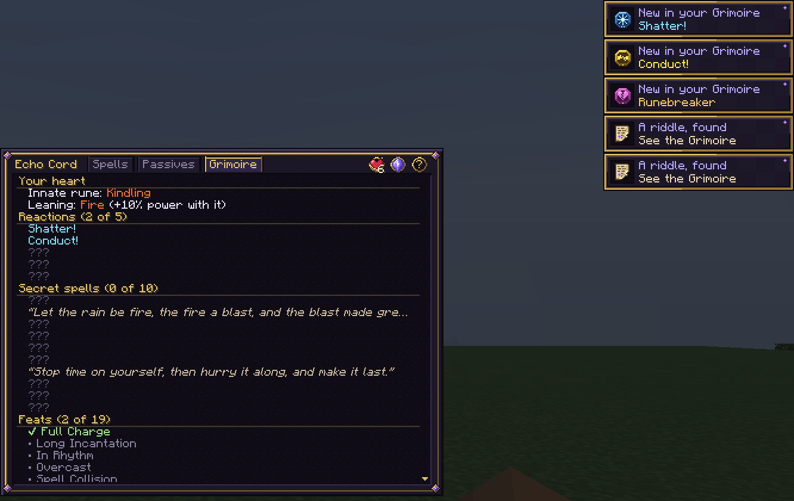

<div align="center">

# Wildercord

**Thread simple runes onto a Cord, in any order, and cast the whole sequence with one key.**

A spell-crafting magic mod for Minecraft Java **26.3** on **Fabric**.

[](https://github.com/defnotean/wildercord/actions/workflows/build.yml)


[](LICENSE)


</div>

---

## Contents

- [What it is](#what-it-is)
- [Features](#features)
- [How spells are read](#how-spells-are-read)
- [Screenshots](#screenshots)
- [Installing (players)](#installing-players)
- [Controls and commands](#controls-and-commands)
- [Building from source](#building-from-source)
- [Project layout](#project-layout)
- [How it works (the short version)](#how-it-works-the-short-version)
- [Extending Wildercord](#extending-wildercord)
- [Testing](#testing)
- [Roadmap](#roadmap)
- [Contributing](#contributing)
- [License](#license)

## What it is

You wear a **Cord** in a new inventory slot (just above your offhand). A Cord has sockets, and
you thread **runes** into them. Each rune is tiny and simple (a *shape*, an *effect*, a
*modifier* or a *link*), but they combine in order, so a handful of runes gives you an enormous
number of spells:

```
Bolt · Fire · Split · On Hit · Burst · Explode
```

> Three bolts of fire. Wherever one lands, an explosion goes off around it.

The Cord screen explains every spell in plain English as you build it, shows exactly what each
modifier attaches to, and prices it in mana and cooldown before you ever cast it.

## Features

| | |
|---|---|
| **186 runes** | 33 shapes, 123 effects, 18 modifiers and 12 links across four tiers, each with a hand-drawn icon (Tier III, Tier IV and innate runes are animated). Ten of the effects are **innate runes**: one wakes in each caster's heart and nobody else can have it. See [docs/RECIPES.md](docs/RECIPES.md). |
| **Charged casting** | Tap to cast, or hold to charge: you raise your hands and a magic circle opens in front of them, for up to 40% more power. While you charge, a reticle shows where the spell will land. |
| **Magic circles you can read** | Every spell writes its own magic circle: a band of script made of its runes, a star with a point for every rune, a roundel on each point with that rune's own emblem, and its shape's seal in the middle. Learn the emblems and you can read what a Runebound, or another player, is about to cast. |
| **Spells drawn in light** | All magic glows: light adds to what's behind it, and void magic is drawn as darkness. Beams with a white-hot core fired through a magic circle, bolts that glide as comets, crescents that sweep like blades, bursts that throw shells of light, rain from a circle in the sky, and a Domain whose floor is the spell's own circle under a dome of light. Every element has its own visual language, from branching lightning to imploding darkness. |
| **Magic you can feel** | Casters raise their hands to charge and move with each shape when it goes off; big impacts shake the camera, a charged release kicks the view, heavy hits land with a punch, and a Domain tints the edges of your screen. The Cord shows on every player's wrist, a glowing bead for each rune of the spell they have ready. |
| **Its own sound** | Every cast, impact, circle, beam, shield and Domain has its own synthesised sound, all in one key so they harmonise, and charging hums higher as it builds. |
| **Spell shields** | Shield is invisible until a spell comes at you; then its magic circles spawn in front of the spell, stacked one behind another (the stronger the Shield, the more circles), and stop it. A spell that cost more mana than yours cracks them and shatters them like glass, front to back, and goes through. |
| **Imbue items and blocks** | Store a spell in your sword (it goes off at what you strike), your pickaxe (at each block it breaks), your bow (with its arrows), your armour (at whatever hurts you) or any item you use, with three charges. Or put it into any block as a glyph that fires at whoever steps on, opens, shoots or breaks it, or on a redstone signal; carry an imbued block and place it where you want the trap. |
| **Secret spells** | Ten exact rune sequences become something new (a sun that falls from the sky, a lance of ice, a black star that swallows everything). Nothing lists them: experiment, or read the riddles on Torn Pages. |
| **The Grimoire** | Every reaction, secret, feat and riddle you discover, written into a page of the Cord screen. Each new reaction, secret and feat condenses mana toward your next Heart Circle. |
| **Runebound and the Archive** | Some monsters carry Cords and cast real spells, glowing with rune marks in their spell's colour and telegraphed by the spell's own circle and a readable nameplate. Deep underground, the Archive holds Rune Seal doors, the Archivist (a hooded, hovering three-phase boss with a floating tome, who rewrites its Cord) and a vault of Tier IV runes. |
| **Ley lines** | Veins of world mana, visible to Cord-wearers as flowing ribbons of violet light: mana flows twice as fast on them. A Wellstone set on one becomes a well for everyone nearby. |
| **Play together** | Paste a spell code (`wc:bolt.frost.split`) in chat and it becomes a readable spell card; inscribe spells onto scrolls anyone can cast; hit the foe another player just hit, with a different element, for **Unison**; win **domain clashes**; shoot enemy bolts out of the air. |
| **Four Cords** | Twine → Copper → Amethyst → Echo: more sockets, more spells, higher rune tiers, more mana. |
| **Ten elements** | Fire, Frost, Storm, Wind, Earth, Life, Void, Arcane, Time and Blood, each with its own look and sound. |
| **Element reactions** | Shatter, Conduct, Wildfire, Implode and Collapse: the right element on the right mark sets off a bonus. |
| **Heart Circles** | Condense mana by casting, earn breakthroughs (mostly feats: set off every reaction, find secret spells, defeat the Archivist), and meditate to form rings of mana around your heart, from the 1st Circle to the 8th (Archmage). In a pinch, **overcast**: crack a circle to cast beyond your mana. |
| **Rhythm and leaning** | Cast again right as your last spell comes off cooldown and the chain builds power. The element you cast most slowly colours your magic and strengthens it. |
| **Passive spells** | Up to two always-on spells (a buff, or an Orbit aura) that drain mana every second instead of having a cooldown. |
| **Mana that grows** | Mana Crystals, Cord enchantments (Reservoir, Wellspring, Siphon), Clarity and Mana potions, meditation, Heart Circles. |
| **Spell enchantments** | Potency, Celerity, Thrift and Persistence make your spells stronger, faster, cheaper and longer. |
| **A readable Cord screen** | Type-to-search Codex, family tabs and category chips, drag and drop, a live plain-English readout, the spell's magic circle opening beside the window as you build it, spell names you can change, and a spell wheel (hold `V`). |
| **A practice dummy** | Place a Training Dummy to try spells on: every hit floats up as a number, and it shows your damage per second. |
| **Crafting and loot** | Every Tier I-III rune is craftable (costlier by tier) and shows in the recipe book; Tier IV runes come from bosses and rare structures. |
| **Server-authoritative** | The client only asks; the server validates every edit and cast. Friendly fire is off, every cast has hard budgets, and spells that change blocks respect spawn protection and claim mods. |
| **Built to extend** | Runes are plain data with traits, so new runes slot into the reading rules without special cases. |

## How spells are read

Runes come in four families. The rules are short, and the Cord screen always shows you the result:

| Family | Colour | What it does | Examples |
|---|---|---|---|
| **Shape** | Teal | Decides *where* and *who*. Starts a group. | Self, Bolt, Beam, Burst, Zone, Orbit, Domain |
| **Effect** | Its element | Decides *what happens* to whatever the shape hit. | Fire, Heal, Freeze, Blink, Stasis, Swap |
| **Modifier** | Gold | Changes the closest rune on its left that it *can* change. | Amplify, Extend, Widen, Split, Homing, Rapid |
| **Link** | Purple | Ends the segment; everything after it fires *later*. | On Hit, Delay, Echo, Pulse, On Hurt, Combo |

1. **A shape starts a group.** Effects before any shape use an implicit shape: Self at the start
   of a spell, or *whatever triggered it* right after a link.
2. **A modifier attaches to the closest rune on its left that has the trait it needs.** Split
   needs something that can split, so in `Bolt · Fire · Split` it skips Fire and doubles up the
   Bolt. It never reaches back past a link.
3. **A link splits the spell.** `On Hit`, `On Kill` and `On Hurt` fire the rest at the thing that
   triggered them; `Delay` and `Pulse` fire it from you later; `Echo` repeats everything before it.

Cost is the sum of each group's shape and effects, scaled by the shape's multiplier and the
modifiers on them. Cooldown is one tick per mana, between 0.5 and 20 seconds. The full design,
with every rune's numbers, is in [docs/DESIGN.md](docs/DESIGN.md).

## Screenshots

### In the world

**Reading a spell circle.** The star has a point for every rune, and each point's roundel carries
that rune's emblem: read them around from the top. This one is Nova, Flashfire, Widen, Shock,
Amplify, On Hit, Burst (a nova of fire and lightning round the caster that bursts again where it
hits); the band of script around it repeats them, and the shape's emblem is the seal in the middle.


| A Domain: the spell's circle as its floor | Beam |
|---|---|
|  |  |
| A Shield: its circles spawn in, stacked, and stop the spell | A stronger spell shatters them like glass, and goes through |
|  |  |
| Imbue: a sword that holds Fire for three strikes | A Frost glyph going off under a husk that stepped on it |
|  |  |
| Crescent | Burst |
|  |  |
| Pillar | Rain |
|  |  |
| Nova, a new Tier I shape | Prism, a new Tier II beam |
|  |  |
| Charging a spell | A Runebound, glowing with its spell's marks |
|  |  |
| **Glacial Lance**, a secret spell | **Tectonic Rise**, a secret spell |
|  |  |
| A domain clash | The Training Dummy |
|  |  |
| The mouth of an Archive | The Archivist |
|  |  |
| A Rune Seal door: only Frost and Storm spells open it | The Archivist's arena |
|  |  |
| A Wellstone on a ley line | The spell wheel |
|  |  |

**The Grimoire:** your innate rune and leaning, and every reaction, secret spell and feat
you've found, with the riddles you've read.



### Screens

| The Codex, searched | The HUD |
|---|---|
|  |  |

**Passive spells:** up to two always-on spells, each with an on/off switch and its upkeep.


**Heart Circles:** hover the heart for your circles, perks and what the next one needs.


<details>
<summary><b>Every rune's emblem and ring pattern</b></summary>

Learn these and you can read any spell being cast. Each rune's emblem (on its roundel, in the band
of script and as a seal) and ring pattern, generated by `tools/circle_art.py`.


</details>

<details>
<summary><b>Every rune icon</b></summary>


</details>

## Installing (players)

1. Install **Minecraft Java 26.3** with **Fabric Loader 0.19.5+**.
2. Put **Fabric API 0.161.0+26.3** (or newer for 26.3) in your `mods` folder.
3. Put the Wildercord jar in your `mods` folder. Until there's a release, build it yourself
   (see below); the jar lands in `build/libs/`.

The mod must be on both the server and every client.

**Getting started in survival:** craft a Blank Rune (4 cobblestone around 1 lapis lazuli), then a
Twine Cord (3 string over a Blank Rune), and put it on in the new slot above your offhand. You
learn Self, Bolt and Push, and your first spell is threaded for you. Right-click any rune item to
learn it.

## Controls and commands

| Key | Action |
|---|---|
| `R` | Cast the selected spell. **Hold** to charge it, then let go |
| `V` | Select the next spell. **Hold** for the spell wheel: point and let go, or let go first and it stays open (click a spell, press its number, or Esc) |
| `K` | Open the Cord screen |
| *(unbound)* | "Cast spell 1-4": bind these to cast a spell directly |
| Sneak + stand still | Meditate: double mana regeneration, and form a Heart Circle when ready |

In the Cord screen: click or drag runes from the Codex onto a spell, drag runes to reorder them,
click a threaded rune to remove it, **just type to search** (Ctrl+F also works, Esc clears). The
small buttons over the readout rename the spell, copy or paste its spell code, and inscribe it
onto a scroll. The **Grimoire** tab lists everything you've discovered.

Out of mana? Cast the same spell again within two seconds to **overcast**: your outermost Heart
Circle cracks for three minutes to pay for it (for a spell costing up to twice your full mana).

Commands (operators, permission level 2):

| Command | Does |
|---|---|
| `/wildercord learnall` | Learn every rune |
| `/wildercord learn <rune>` | Learn one rune, e.g. `stasis` or `wildercord:stasis` (an add-on's runes by their full id) |
| `/wildercord spell <1-4> <runes...>` | Thread a spell directly |
| `/wildercord mana` | Refill your mana |
| `/wildercord circles <0-8>` | Set your Heart Circles |
| `/wildercord condense <mana>` | Add condensed mana toward the next circle |
| `/wildercord innate <rune>` | Choose your innate rune |
| `/wildercord runebound` | Bind the nearest monster to a Cord |
| `/place structure wildercord:archive` | Build an Archive where you stand (vanilla command) |
| `/wildercord reset` | Forget every rune and spell |

## Building from source

Requirements: **JDK 25** and Python 3.11+ with **Pillow** (only for regenerating art and data).
Gradle comes with the wrapper.

```bash
git clone https://github.com/defnotean/wildercord.git
cd wildercord
./gradlew build
```

The jar is in `build/libs/`. Useful tasks:

| Task | What it does |
|---|---|
| `./gradlew runClient` | Starts a dev client with the mod loaded |
| `./gradlew test` | Runs the spell-engine unit tests (pure Java, no Minecraft needed, a few seconds) |
| `./gradlew runClientGameTest` | Starts a real client, builds a world, checks the mechanics and saves screenshots |
| `python tools/generate_assets.py` | Regenerates textures, models, language, recipes, enchantments and `docs/RECIPES.md` |
| `./gradlew -PaltBuild compileJava` | Compiles into `build-alt/`, so you can check code while a dev client is running |

> **Heads up:** Loom's dev client loads classes straight from `build/`. Don't run `build`,
> `runClientGameTest` or a second `runClient` while a dev client is open: use `-PaltBuild` to
> compile-check instead, then restart the client.

## Project layout

```
src/
├── main/java/dev/wildercord/
│   ├── spell/      The spell engine: pure Java, no Minecraft imports.
│   │                 Runes (the roster), RuneDef, Trait, RuneCategories, SpellCompiler,
│   │                 SpellPlan, SpellNumbers, Passives, Circles, Secrets, Feats, Leaning,
│   │                 SpellNames, SpellCodes, SpellSigil
│   ├── cast/       Running spells in the world: SpellCaster (the gate), CastEngine, Cast,
│   │                 Casters, Targets, ShapeRunners, Effects, Techniques, Wards, Reactions,
│   │                 Scheduler, Spirits, RuneBolt, HeartCircles, PassiveCaster, Charging,
│   │                 Rhythm, Overcast, Unison, DomainClash, SecretSpells, Innates, Grimoire,
│   │                 Shields, Imbuing,
│   │                 Runebound, Archivist, RuneSeals, LeyWalker, TrainingDummy, SpellChat,
│   │                 CordLook, ScreenFx, Vfx, TechniqueVfx, ExpansionVfx, ElementFx, Light,
│   │                 Sigils, BlockFx, Fx
│   ├── player/     Per-player state: Spellbook, Mana, Heart, WildercordAttachments
│   ├── content/    Items, blocks (Wellstone, Rune Seal, Archive Lectern), Cord tiers, data
│   │                 components, the sigil, spell circle and light particles, sounds, potions,
│   │                 loot
│   ├── world/      The Archive structure, and ley lines (pure maths shared by both sides)
│   ├── menu/       The Cord slot
│   ├── mixin/      Cord slot in the inventory menu, creative sync, lightning rods,
│   │                 Phantom's afterimage, pistons (temporary blocks stay put), imbued arrows
│   │                 and placed imbued blocks
│   ├── net/        Packets: cast, charge, select, edit, rename, passives, scrolls; and the
│   │                 notices the server sends (discoveries, the ley seed, screen effects)
│   └── command/    /wildercord
├── client/java/dev/wildercord/client/
│                   CordScreen (with the Grimoire page and GuiSpellCircle), SpellHud,
│                   SpellWheelScreen, GrimoireToast, key bindings; mixins (inventory screens,
│                   casting poses, camera shake, the glow pipelines);
│                   fx/ (glow blending, magic circles, shaped light, comets, charging, aim
│                   preview, screen effects, ley ribbons, Archive ambience, shield circles and
│                   their shattering) and
│                   render/ (the worn Cord, Runebound marks, the Archivist, the Training Dummy)
├── main/resources/ Generated assets and data (textures, models, lang, recipes, ...)
├── test/           JUnit tests for the spell engine (and ley lines)
└── gametest/       Client game tests: mechanics checks, screenshots and the feature tour
tools/
├── generate_assets.py   Reads Runes.java and writes every asset and data file
├── item_art.py          Hand-tuned pixel art for runes, cords and badges
├── gui_art.py           GUI and HUD sprites
├── sigil_art.py         Magic circles, and the wheel, beat ring and toast sprites
├── shield_art.py        The glass shards and crack lines of a Shield's breaking circles
├── circle_art.py        Every rune's own ring pattern and emblem for magic circles
├── world_art.py         Scroll, page, dummy, Wellstone, seals, lectern, entity skins, rune marks
├── wear_art.py          The Cord players wear on the wrist
├── sound_art.py         Every sound, synthesised: casts, impacts, charging, circles and the UI
└── make_gif.py          The moving header at the top of this README, from the feature tour
docs/
├── DESIGN.md            The full design: every rune, number and rule
├── ARCHITECTURE.md      How the code fits together, for developers
├── ART.md               The Wildercord look: colour, circles, light, motion, icons and sound
├── ADDING_RUNES.md      Step by step: adding a shape, effect, modifier or link
├── RECIPES.md           Every recipe and drop (generated)
└── images/              The screenshots in this README
```

## How it works (the short version)

```
 client                              server
┌──────────────┐  EditSpell   ┌──────────────────────────────────────────────┐
│  CordScreen  │ ───────────▶ │ SpellCaster.edit   validates, saves Spellbook │
│  SpellHud    │  CastSpell   │ SpellCaster.cast   Cord? learned? cooldown?   │
│  (key R)     │ ───────────▶ │                    mana? then:                │
└──────────────┘              │   SpellCompiler.compile(runes) → SpellPlan    │
                              │   CastEngine.cast(plan)                       │
                              │     ├─ shapes find hits (ShapeRunners)        │
                              │     ├─ effects apply (Effects, Techniques)    │
                              │     ├─ links schedule the rest (Scheduler)    │
                              │     └─ visuals (Vfx, TechniqueVfx → Fx)       │
                              └──────────────────────────────────────────────┘
```

- **`spell/` is pure data and logic.** `Runes` lists every rune as a `RuneDef` record; the
  compiler turns a list of runes into a `SpellPlan`, prices it and explains it. Because none of it
  touches Minecraft, the readout the player sees and the spell the server runs can never disagree,
  and it's all unit-tested.
- **`cast/` runs a plan in the world.** A `Cast` carries hard budgets (64 creatures, 32 blocks,
  8 link depth, 128 parts in all) shared by everything it chains into, so no spell can run away. Its caster can be
  any living thing, so Runebound monsters and the Archivist cast through the same engine.
- **Player state lives in Fabric data attachments**: saved, synced to the owner, and kept
  through death where it should be.

The full tour, with the reasoning behind each piece, is in
[docs/ARCHITECTURE.md](docs/ARCHITECTURE.md).

## Extending Wildercord

Adding a rune is usually a few lines: a `RuneDef` in `Runes`, its behaviour in `Effects` (or a
runner in `ShapeRunners`), a visual, a glyph, and a recipe. Modifiers find what they can change
through **traits**, not lists, so a new effect that declares `POWER` is amplified by Amplify with
no other changes. Walk through it in [docs/ADDING_RUNES.md](docs/ADDING_RUNES.md).

## Testing

- **Unit tests** (`./gradlew test`): the compiler's reading rules, costs, cooldowns, Blood Price,
  Vow, passive rules, Heart Circle and enchantment maths; spell names and codes, secret spells,
  leaning, innate runes, ley lines and the breakthrough table.
- **Client game tests** (`./gradlew runClientGameTest`): starts a real client and world, then
  - screenshots the HUD and Cord screen at every GUI scale and three window sizes,
  - casts every newer rune at test mobs (any exception fails the run),
  - checks mechanics for real: Stasis holds Sonic Boom, Primer, Meteor and more until time moves
    again; Reflect, Foresight, Reversal, Blood Price and Combo work; passives drain mana; forming a
    Heart Circle raises max mana; the Cord screen turns on text input for its search box; a Shield
    stops a spell that costs no more than it and breaks under one that costs more; an imbued sword,
    a glyph and a placed imbued block release what they hold, and a broken glyph comes back imbued;
  - tours the world features on a cleared stage (charging, the wheel, every secret spell,
    Runebound, the dummy, a domain clash, overcasting, a ley line, and a placed Archive with its
    Archivist), asserting what it can and screenshotting the rest. Set `WILDERCORD_TOUR_ONLY=1` to
    run just the tour; the images in [Screenshots](#screenshots) come from it.

Screenshots land in `build/run/clientGameTest/screenshots/`. CI runs the build and unit tests on
every push.

## Roadmap

- **Fusion Altar:** upgrade three of a rune into a stronger one, combine two effects into a new
  one, and tie a finished spell into a single Knot rune you can share (see DESIGN.md).
- An add-on API so other mods can register runes, categories and reactions.
- Config for server owners (budgets, PvP scaling, loot chances).

## Contributing

Issues and pull requests are welcome. Start with [CONTRIBUTING.md](CONTRIBUTING.md): it covers
setting up, the code style, the asset pipeline, and what a good PR includes.

## License

[MIT](LICENSE). Use it, learn from it, build on it.
