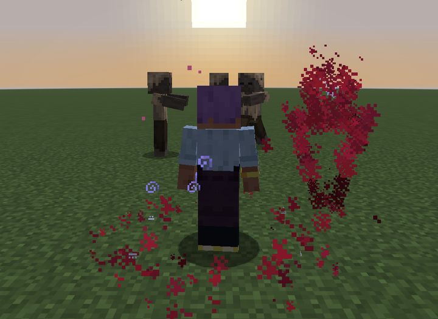

<div align="center">

# Wildercord

**Thread simple runes onto a Cord, in any order, and cast the whole sequence with one key.**

A spell-crafting magic mod for Minecraft Java **26.3** on **Fabric**.

[](https://github.com/defnotean/wildercord/actions/workflows/build.yml)


[](LICENSE)


</div>

---

## Contents

- [What it is](#what-it-is)
- [Features](#features)
- [How spells are read](#how-spells-are-read)
- [Screenshots](#screenshots)
- [Installing (players)](#installing-players)
- [Controls and commands](#controls-and-commands)
- [Building from source](#building-from-source)
- [Project layout](#project-layout)
- [How it works (the short version)](#how-it-works-the-short-version)
- [Extending Wildercord](#extending-wildercord)
- [Testing](#testing)
- [Roadmap](#roadmap)
- [Contributing](#contributing)
- [License](#license)

## What it is

You wear a **Cord** in a new inventory slot (just above your offhand). A Cord has sockets, and
you thread **runes** into them. Each rune is tiny and simple (a *shape*, an *effect*, a
*modifier* or a *link*), but they combine in order, so a handful of runes gives you an enormous
number of spells:

```
Bolt · Fire · Split · On Hit · Burst · Explode
```

> Three bolts of fire. Wherever one lands, an explosion goes off around it.

The Cord screen explains every spell in plain English as you build it, shows exactly what each
modifier attaches to, and prices it in mana and cooldown before you ever cast it.

## Features

| | |
|---|---|
| **135 runes** | 23 shapes, 83 effects, 18 modifiers and 11 links across four tiers, each with a hand-drawn animated icon. See [docs/RECIPES.md](docs/RECIPES.md). |
| **Four Cords** | Twine → Copper → Amethyst → Echo: more sockets, more spells, higher rune tiers, more mana. |
| **Ten elements** | Fire, Frost, Storm, Wind, Earth, Life, Void, Arcane, Time and Blood, each with its own look and sound. |
| **Element reactions** | Shatter, Conduct, Wildfire, Implode and Collapse: the right element on the right mark sets off a bonus. |
| **Heart Circles** | Condense mana by casting, earn breakthroughs, and meditate to form rings of mana around your heart, from the 1st Circle to the 8th (Archmage). |
| **Passive spells** | Up to two always-on spells (a buff, or an Orbit or Stand aura) that drain mana every second instead of having a cooldown. |
| **Mana that grows** | Mana Crystals, Cord enchantments (Reservoir, Wellspring, Siphon), Clarity and Mana potions, meditation, Heart Circles. |
| **Spell enchantments** | Potency, Celerity, Thrift and Persistence make your spells stronger, faster, cheaper and longer. |
| **A readable Cord screen** | Type-to-search Codex, family tabs and category chips, drag and drop, and a live plain-English readout. |
| **Crafting and loot** | Every Tier I-III rune is craftable (costlier by tier) and shows in the recipe book; Tier IV runes come from bosses and rare structures. |
| **Server-authoritative** | The client only asks; the server validates every edit and cast. Friendly fire is off, and every cast has hard budgets. |
| **Built to extend** | Runes are plain data with traits, so new runes slot into the reading rules without special cases. |

## How spells are read

Runes come in four families. The rules are short, and the Cord screen always shows you the result:

| Family | Colour | What it does | Examples |
|---|---|---|---|
| **Shape** | Teal | Decides *where* and *who*. Starts a group. | Self, Bolt, Beam, Burst, Zone, Orbit, Stand, Domain |
| **Effect** | Its element | Decides *what happens* to whatever the shape hit. | Fire, Heal, Freeze, Blink, Stasis, Swap |
| **Modifier** | Gold | Changes the closest rune on its left that it *can* change. | Amplify, Extend, Widen, Split, Homing, Rapid |
| **Link** | Purple | Ends the segment; everything after it fires *later*. | On Hit, Delay, Echo, Pulse, On Hurt, Combo |

1. **A shape starts a group.** Effects before any shape use an implicit shape: Self at the start
   of a spell, or *whatever triggered it* right after a link.
2. **A modifier attaches to the closest rune on its left that has the trait it needs.** Split
   needs something that can split, so in `Bolt · Fire · Split` it skips Fire and doubles up the
   Bolt. It never reaches back past a link.
3. **A link splits the spell.** `On Hit`, `On Kill` and `On Hurt` fire the rest at the thing that
   triggered them; `Delay` and `Pulse` fire it from you later; `Echo` repeats everything before it.

Cost is the sum of each group's shape and effects, scaled by the shape's multiplier and the
modifiers on them. Cooldown is one tick per mana, between 0.5 and 20 seconds. The full design,
with every rune's numbers, is in [docs/DESIGN.md](docs/DESIGN.md).

## Screenshots

| The Codex, searched | The HUD |
|---|---|
|  |  |

| A Stand, striking | Passive spells |
|---|---|
|  |  |

**Heart Circles:** hover the heart for your circles, perks and what the next one needs.


<details>
<summary><b>Every rune icon</b></summary>


</details>

## Installing (players)

1. Install **Minecraft Java 26.3** with **Fabric Loader 0.19.5+**.
2. Put **Fabric API 0.161.0+26.3** (or newer for 26.3) in your `mods` folder.
3. Put the Wildercord jar in your `mods` folder. Until there's a release, build it yourself
   (see below); the jar lands in `build/libs/`.

The mod must be on both the server and every client.

**Getting started in survival:** craft a Blank Rune (4 cobblestone around 1 lapis lazuli), then a
Twine Cord (3 string over a Blank Rune), and put it on in the new slot above your offhand. You
learn Self, Bolt and Push, and your first spell is threaded for you. Right-click any rune item to
learn it.

## Controls and commands

| Key | Action |
|---|---|
| `R` | Cast the selected spell |
| `V` | Select the next spell |
| `K` | Open the Cord screen |
| *(unbound)* | "Cast spell 1-4": bind these to cast a spell directly |
| Sneak + stand still | Meditate: double mana regeneration, and form a Heart Circle when ready |

In the Cord screen: click or drag runes from the Codex onto a spell, drag runes to reorder them,
click a threaded rune to remove it, **just type to search** (Ctrl+F also works, Esc clears).

Commands (operators, permission level 2):

| Command | Does |
|---|---|
| `/wildercord learnall` | Learn every rune |
| `/wildercord learn <rune>` | Learn one rune, e.g. `wildercord:stasis` |
| `/wildercord spell <1-4> <runes...>` | Thread a spell directly |
| `/wildercord mana` | Refill your mana |
| `/wildercord circles <0-8>` | Set your Heart Circles |
| `/wildercord condense <mana>` | Add condensed mana toward the next circle |
| `/wildercord reset` | Forget every rune and spell |

## Building from source

Requirements: **JDK 25** and Python 3.11+ with **Pillow** (only for regenerating art and data).
Gradle comes with the wrapper.

```bash
git clone https://github.com/defnotean/wildercord.git
cd wildercord
./gradlew build
```

The jar is in `build/libs/`. Useful tasks:

| Task | What it does |
|---|---|
| `./gradlew runClient` | Starts a dev client with the mod loaded |
| `./gradlew test` | Runs the spell-engine unit tests (pure Java, no Minecraft needed, a few seconds) |
| `./gradlew runClientGameTest` | Starts a real client, builds a world, checks the mechanics and saves screenshots |
| `python tools/generate_assets.py` | Regenerates textures, models, language, recipes, enchantments and `docs/RECIPES.md` |
| `./gradlew -PaltBuild compileJava` | Compiles into `build-alt/`, so you can check code while a dev client is running |

> **Heads up:** Loom's dev client loads classes straight from `build/`. Don't run `build`,
> `runClientGameTest` or a second `runClient` while a dev client is open: use `-PaltBuild` to
> compile-check instead, then restart the client.

## Project layout

```
src/
├── main/java/dev/wildercord/
│   ├── spell/      The spell engine: pure Java, no Minecraft imports.
│   │                 Runes (the roster), RuneDef, Trait, RuneCategories, SpellCompiler,
│   │                 SpellPlan, SpellNumbers, Passives, Circles
│   ├── cast/       Running spells in the world: SpellCaster (the gate), CastEngine, Cast,
│   │                 ShapeRunners, Effects, Techniques, Wards, Reactions, Scheduler, Spirits,
│   │                 RuneBolt, HeartCircles, PassiveCaster, Vfx, TechniqueVfx, Fx
│   ├── player/     Per-player state: Spellbook, Mana, Heart, WildercordAttachments
│   ├── content/    Items, Cord tiers, data components, potions, loot
│   ├── menu/       The Cord slot
│   ├── mixin/      Cord slot in the inventory menu, creative sync, lightning rods
│   ├── net/        Client-to-server packets (cast, select, edit, passives)
│   └── command/    /wildercord
├── client/java/dev/wildercord/client/
│                   CordScreen, SpellHud, key bindings, inventory screen mixins
├── main/resources/ Generated assets and data (textures, models, lang, recipes, ...)
├── test/           JUnit tests for the spell engine
└── gametest/       Client game tests: mechanics checks and screenshots
tools/
├── generate_assets.py   Reads Runes.java and writes every asset and data file
├── item_art.py          Hand-tuned pixel art for runes, cords and badges
└── gui_art.py           GUI and HUD sprites
docs/
├── DESIGN.md            The full design: every rune, number and rule
├── ARCHITECTURE.md      How the code fits together, for developers
├── ADDING_RUNES.md      Step by step: adding a shape, effect, modifier or link
└── RECIPES.md           Every recipe and drop (generated)
```

## How it works (the short version)

```
 client                              server
┌──────────────┐  EditSpell   ┌──────────────────────────────────────────────┐
│  CordScreen  │ ───────────▶ │ SpellCaster.edit   validates, saves Spellbook │
│  SpellHud    │  CastSpell   │ SpellCaster.cast   Cord? learned? cooldown?   │
│  (key R)     │ ───────────▶ │                    mana? then:                │
└──────────────┘              │   SpellCompiler.compile(runes) → SpellPlan    │
                              │   CastEngine.cast(plan)                       │
                              │     ├─ shapes find hits (ShapeRunners)        │
                              │     ├─ effects apply (Effects, Techniques)    │
                              │     ├─ links schedule the rest (Scheduler)    │
                              │     └─ visuals (Vfx, TechniqueVfx → Fx)       │
                              └──────────────────────────────────────────────┘
```

- **`spell/` is pure data and logic.** `Runes` lists every rune as a `RuneDef` record; the
  compiler turns a list of runes into a `SpellPlan`, prices it and explains it. Because none of it
  touches Minecraft, the readout the player sees and the spell the server runs can never disagree,
  and it's all unit-tested.
- **`cast/` runs a plan in the world.** A `Cast` carries hard budgets (64 creatures, 32 blocks,
  8 link depth) shared by everything it chains into, so no spell can run away.
- **Player state lives in Fabric data attachments**: saved, synced to the owner, and kept
  through death where it should be.

The full tour, with the reasoning behind each piece, is in
[docs/ARCHITECTURE.md](docs/ARCHITECTURE.md).

## Extending Wildercord

Adding a rune is usually a few lines: a `RuneDef` in `Runes`, its behaviour in `Effects` (or a
runner in `ShapeRunners`), a visual, a glyph, and a recipe. Modifiers find what they can change
through **traits**, not lists, so a new effect that declares `POWER` is amplified by Amplify with
no other changes. Walk through it in [docs/ADDING_RUNES.md](docs/ADDING_RUNES.md).

## Testing

- **Unit tests** (`./gradlew test`): the compiler's reading rules, costs, cooldowns, Blood Price,
  Vow, passive rules, Heart Circle and enchantment maths.
- **Client game tests** (`./gradlew runClientGameTest`): starts a real client and world, then
  - screenshots the HUD and Cord screen at every GUI scale and three window sizes,
  - casts every newer rune at test mobs (any exception fails the run),
  - checks mechanics for real: Stasis holds Sonic Boom, Primer, Meteor and more until time moves
    again; Reflect, Foresight, Reversal, Blood Price and Combo work; passives drain mana; forming a
    Heart Circle raises max mana; the Cord screen turns on text input for its search box.

Screenshots land in `build/run/clientGameTest/screenshots/`. CI runs the build and unit tests on
every push.

## Roadmap

- **Fusion Altar:** upgrade three of a rune into a stronger one, combine two effects into a new
  one, and tie a finished spell into a single Knot rune you can share (see DESIGN.md).
- A hold-to-choose spell wheel.
- An add-on API so other mods can register runes, categories and reactions.
- Config for server owners (budgets, PvP scaling, loot chances).

## Contributing

Issues and pull requests are welcome. Start with [CONTRIBUTING.md](CONTRIBUTING.md): it covers
setting up, the code style, the asset pipeline, and what a good PR includes.

## License

[MIT](LICENSE). Use it, learn from it, build on it.
